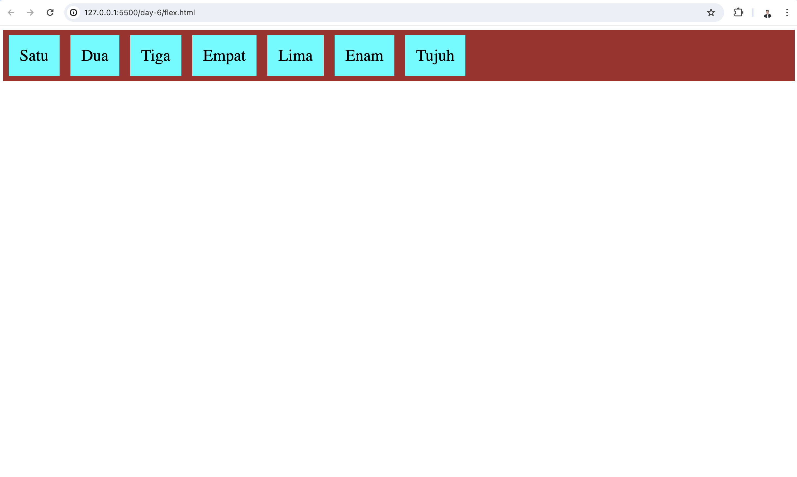
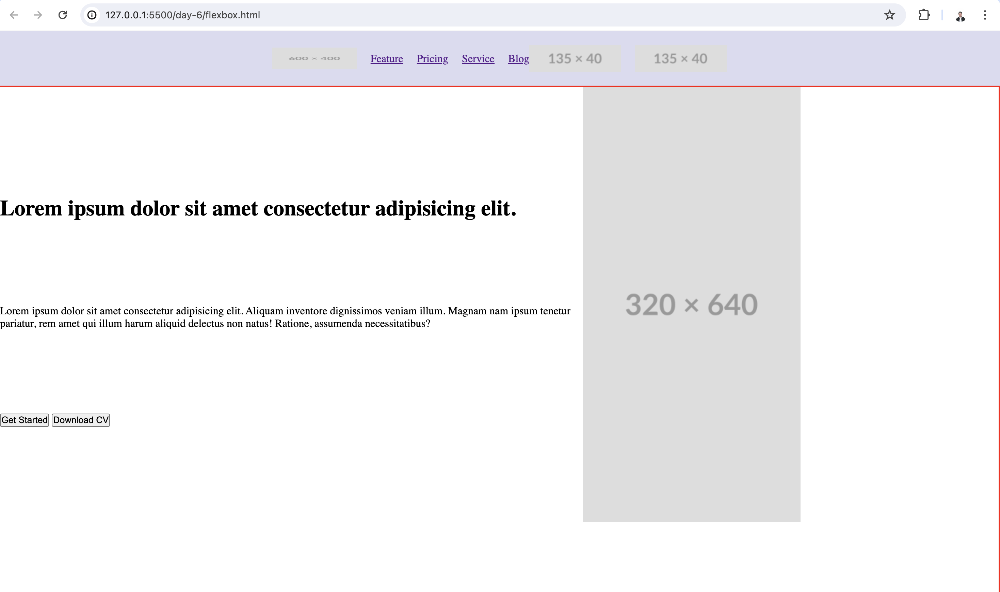
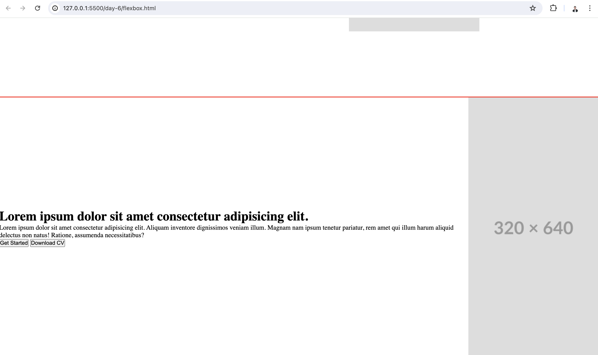
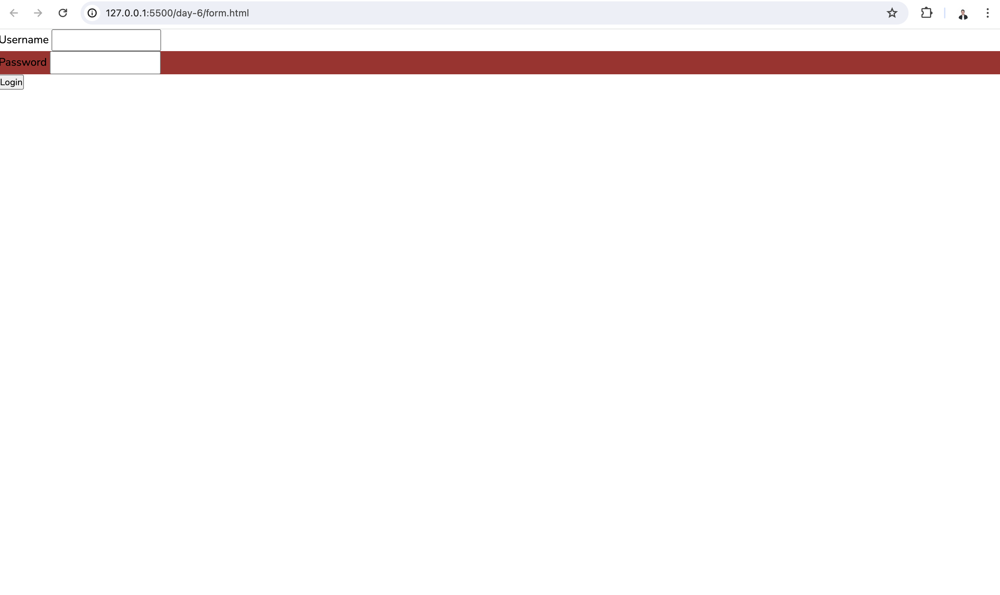

# Day 6

Day 6 is all about CSS and CSS Layout

- CSS Introduction
- Introduction CSS selector, property, and value
- Introduction to CSS property
- Target HTML pseudo class
- CSS Rule Specificity
- Practice CSS Box model and CSS Grid model

In day 6 class, i follow how the mentor teach me about CSS practically. We create some html files with style.css file. This is view from what we learn in day-6.

You can look at the files here

- [learn about flex box](../assets/day-6/flexbox.html)
- [learn about grid](../assets/day-6/flex.html)
- [learn about form](../assets/day-6/form.html)
- [css file](../assets/day-6/style.css)
